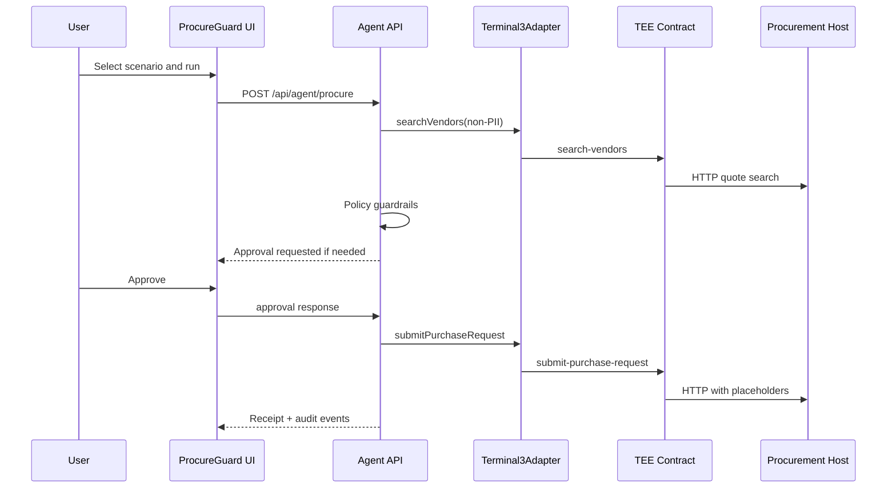

# ProcureGuard Architecture

ProcureGuard is split into four layers:

1. Web dashboard
   - Scenario selection, request editing, agent workstream, approval gate, and evidence export.
   - Runs as a Next.js App Router application.

2. Agent API
   - `POST /api/agent/procure` streams NDJSON events.
   - It validates the request, searches vendors through `Terminal3Adapter.searchVendors`, evaluates policy, drafts the recommendation, pauses for approval when required, and submits through `Terminal3Adapter.submitPurchaseRequest`.

3. Terminal 3 adapter
   - `MockTerminal3Adapter` keeps local judging deterministic.
   - `RealTerminal3Adapter` is the intended boundary for `@terminal3/t3n-sdk` calls in real testnet mode.
   - The same public methods are used by the agent in both modes.

4. TEE contract package
   - `contracts/procureguard-tee` defines `search-vendors` and `submit-purchase-request`.
   - `search-vendors` is the non-PII outbound call path.
   - `submit-purchase-request` is the PII-sensitive path and uses placeholder-style payload construction.

## Data Flow

## Real Mode Readiness

The dashboard exposes a readiness checklist based on environment configuration:

- `T3N_API_KEY`, `USER_KEY`, `AGENT_KEY`
- `T3_TENANT_DID`
- `T3_AGENT_DID`
- `T3_CONTRACT_VERSION`
- `PROCUREMENT_API_BASE`
- `PROCUREMENT_API_KEY`
- `T3_GRANT_CONFIGURED`

Mock mode remains available for judging without credentials.
